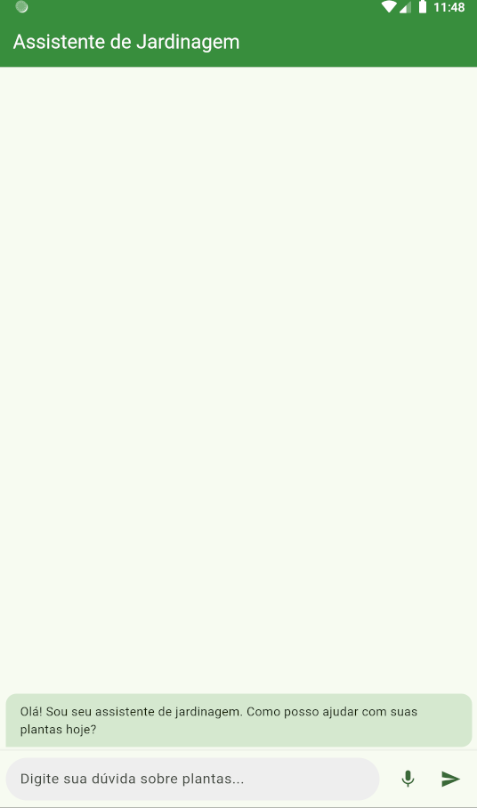
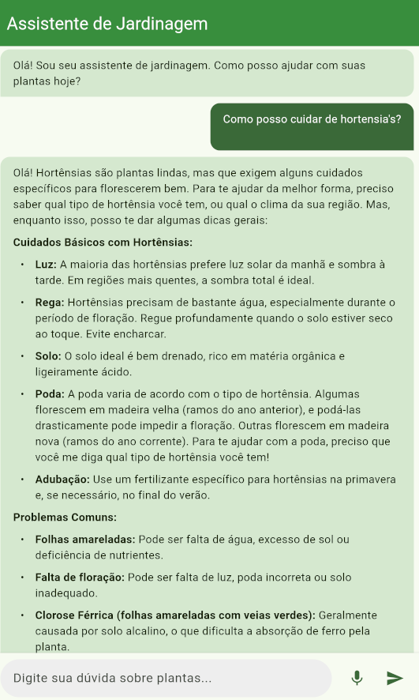

# Projeto: Assistente de Jardinagem
**Autor:** Lucas Dreveck

## Descrição do App

O Assistente de Jardinagem é um aplicativo móvel desenvolvido em Flutter que ajuda usuários a cuidarem de suas plantas. Ele utiliza um Modelo de Linguagem Grande (LLM), especificamente o Gemini do Google, para fornecer dicas personalizadas, identificar problemas e oferecer soluções com base nas perguntas dos usuários. O app também conta com funcionalidade de conversão de voz para texto, permitindo que os usuários façam suas perguntas oralmente.

## Imagens ou GIFs do App Funcionando

**Tela Principal:**

**Interação com o Assistente:**


## Tecnologias Utilizadas

*   **Flutter:** Framework de desenvolvimento de UI para criar aplicativos compilados nativamente para mobile, web e desktop a partir de uma única base de código.
*   **Dart:** Linguagem de programação utilizada pelo Flutter.
*   **Google Gemini API:** Modelo de Linguagem Grande (LLM) utilizado para gerar as dicas de jardinagem e responder às perguntas dos usuários. Especificamente, foi usado o modelo `gemini-2.0-flash`.
*   **`speech_to_text` (Flutter Package):** Plugin para converter a fala do usuário em texto.
*   **`flutter_dotenv` (Flutter Package):** Para gerenciar chaves de API e outras variáveis de ambiente de forma segura, carregando-as de um arquivo `.env`.
*   **`provider` (Flutter Package):** Para gerenciamento de estado de forma simples e eficaz.
*   **`permission_handler` (Flutter Package):** Para solicitar permissões de tempo de execução (como acesso ao microfone).
*   **`flutter_markdown` (Flutter Package):** Para deixar a resposta do Gemini mais legível.
*   **`url_launcher` (Flutter Package):** Para abrir possíveis links que possam estar na resposta do Gemini. 
*   **Material Design:** Diretrizes de design visual utilizadas para a interface do usuário.

## Instruções de Instalação e Execução

1.  **Pré-requisitos:**
    *   Flutter SDK instalado (versão 3.x ou superior).
    *   Um editor de código (VS Code, Android Studio).
    *   Um emulador Android/iOS configurado ou um dispositivo físico.
    *   Uma chave de API do Google Gemini. Você pode obter uma no [Google AI Studio](https://aistudio.google.com/app/apikey).

2.  **Clone o repositório:**
    ```bash
    git clone https://github.com/Lucas-Dreveck/gardening_assistant.git
    cd gardening_assistant
    ```

3.  **Crie o arquivo de ambiente:**
    *   Na raiz do projeto, crie um arquivo chamado `.env`.
    *   Adicione sua chave da API do Gemini a este arquivo:
        ```
        GEMINI_API_KEY=SUA_CHAVE_API_AQUI
        ```

4.  **Instale as dependências:**
    ```bash
    flutter pub get
    ```

5.  **Execute o aplicativo:**
    *   Certifique-se de que um dispositivo ou emulador esteja em execução.
    *   Execute o comando:
        ```bash
        flutter run
        ```

## Explicação de como o LLM foi utilizado

O Modelo de Linguagem Grande (LLM), Gemini do Google, é o cérebro por trás das dicas de jardinagem fornecidas pelo aplicativo. Ele foi integrado da seguinte forma:

1.  **Configuração da API:**
    *   Uma chave de API do Google Gemini foi obtida e armazenada de forma segura usando o pacote `flutter_dotenv` em um arquivo `.env` (que não é versionado no Git).
    *   No código, a classe `GeminiService` é responsável por inicializar o modelo `gemini-2.0-flash` com esta chave.

2.  **Envio da Pergunta do Usuário:**
    *   Quando o usuário digita uma pergunta sobre uma planta ou um problema de jardinagem (ou usa a função de voz para texto para inserir a pergunta), essa string de texto é enviada para a `GeminiService`.

3.  **Construção do Prompt:**
    *   Dentro da `GeminiService`, um *prompt* cuidadosamente elaborado é construído. Este prompt instrui o LLM a agir como um "assistente de jardinagem especializado" e inclui a pergunta do usuário. O prompt também orienta o LLM sobre o tom da resposta e o que fazer em casos de perguntas vagas ou fora do escopo de jardinagem. Exemplo de estrutura do prompt:
        ```
        Você é um assistente de jardinagem especializado.
        Um usuário precisa de ajuda com a seguinte planta ou problema: "[PERGUNTA_DO_USUARIO_AQUI]".
        Forneça dicas claras, concisas e úteis...
        ```

4.  **Geração da Resposta:**
    *   O prompt, juntamente com a pergunta do usuário, é enviado para a API do Gemini.
    *   O LLM processa essa entrada e gera uma resposta em texto.

5.  **Exibição da Resposta:**
    *   A resposta textual recebida da API do Gemini é então exibida na interface do usuário como uma mensagem do "bot" assistente convertido pelo `flutter_markdown`, fornecendo ao usuário as dicas e informações solicitadas.

Este processo permite que o aplicativo forneça respostas dinâmicas e contextualmente relevantes para uma ampla gama de questões sobre jardinagem, aproveitando o vasto conhecimento e a capacidade de geração de texto do LLM Gemini.
